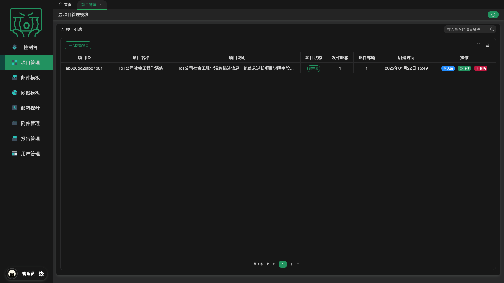
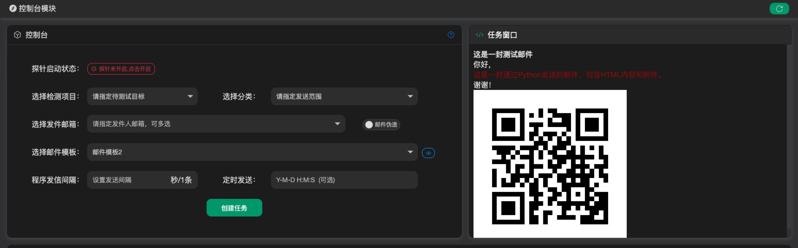

# ToT
## 平台介绍
ToT社会工程学演练平台（ToT SocialEngineeringDrillPlatform，以下简称ToT平台）是一款自动化钓鱼工具平台，ToT平台是一种用于提高组织安全意识、检测安全防护能力以及提升员工安全意识的平台工具。其核心目标是通过模拟真实的钓鱼攻击场景，在非破坏性的前提下测试员工对网络钓鱼攻击的抵御能力，同时帮助组织完善网络安全策略。

ToT平台前端使用Layui，后端使用Django+Redis+SQLite构成，支持数据库扩展sqlite3，mysql，postgresql，oracle使用。ToT平台伪前后端分离，所有功能接口化，可配合接入整合到其他平台。

ToT平台主要包含以下7大模块，控制台模块，项目管理模块，邮件模板模块，网站模版模块，邮件探针模块，附件管理模块，报告管理模块以及态势展示模块，接下来按照操作流程维度分模块详细介绍。

## 功能模块介绍

### 项目管理模块
为了满足对目标企业不同部门分别定制钓鱼方案，拟定设计2级项目结构，一级项目定义为XX公司，二级项目定义为XX公司XX部门，可配置多级部门。项目列表界面如下：

在一级部门结构中可分为两部分，第一部分为创建二级部门相关内容，第二部分为配置该项目发送邮件账户信息，截图如下：

第一部分，支持二级部门的增删查操作，支持项目名称，分类描述，部门内部邮箱数量，创建时间的查看。二级部门详情邮箱增删查，邮件列表导入支持手动填写，支持XLS，TXT拖拽上传.

第二部分配置该项目发送邮件账户信息，支持邮箱账户信息创建，支持创建邮件发信测试，支持增删改查。

### 邮件模板模块
可根据需求定制创建邮件模板，该功能支持邮件模板的创建，邮件页面预览，邮件配置预览，

邮件模板功能支持增删改查，邮件模板制作支持手动编辑，支持EML邮件自动导入解析，邮件模板支持上传附件，支持附件压缩，附件加密，可自定义监听范围，如邮件访问监听，邮件附件监听（证实邮件附件是否执行），同时还支持钓鱼网站的插入，可配合钓鱼网站进行数据获取。

钓鱼网站链接插入支持二维码以及超链接，全自动化配置生成，仅需将内容粘贴到指定位置。

### 网站模板模块

可根据需求快速制作钓鱼网站模板，该功能支持钓鱼网站的快速制作，预览，删除以及编辑

该功能支持两种方式进行快速制作钓鱼网站模版，第一种远程网站克隆，第二种本地网站源码文件智能解析快速部署。按照部署需求可配置是否数据获取，以及达成目标后的二次跳转

### 邮件探针模块

该功能为探针模块，探针开启后可进行数据的嗅探以及钓鱼网站的部署，探针回收的数据也可以在该功能进行展示，可根据需求灵活配置外网部署或内网部署，支持IP端口自定义

探针诱捕数据可根据项目维度进行查看，数据包含所属子项目名称（二级部门），发信时间，捕获时间，用户行为操作（邮件点击，钓鱼网站访问，钓鱼网站数据填写以及钓鱼邮件附件执行），来源地址以及，填写数据详情查看

### 附件管理模块

该功能可自动化生成免杀恶意附件，支持Windows程序，MacOS程序生成，可配置反链地址，当程序被执行后可命中探针捕获数据。并定位到执行程序的人员信息。同时附件还支持混淆，如LNK钓鱼，RLO钓鱼等。

生成附件程序支持自定义内容输出已达到迷惑效果.

根据部署环境需要配置相关编译变量，提供相关配置建议。

### 报告管理模块

可对执行完成的项目进行报告的输出，支持查询，生成，删除，下载。

生成报告模板如下图，Word模版可自定义。

### 控制台模块

根据创造的数据资源，目标范围，在控制台操作预览任务，发送执行任务，支持项目选中，子分类选中，选中发件邮箱，邮件模板选中，配置发送间隔，已经发送时间等

支持邮件预览，选中右键模板后支持预览

支持邮件伪造

任务列表可现实任务状态，支持删除，跳转，取消计划任务等

单击任务可预览任务状态信息

### 态势展示模块

该功能入口可在控制台任务列表跳转，以及项目管理列表访问，访问条件为项目执行中或已完成才可以访问；

态势展示界面展示当前项目的状态信息，进展信息，诱捕类型占比信息，以及中招信息，根据中招信息按照每日中招折线图显示，中招人员滚动显示，以及获取到的信息的数据展示。

态势界面支持自动刷新，全屏等小功能

### 登录认证模块

平台目前仅支持单用户管理员登录，存在多因素校验策略

### 用户模块

当前平台支持多角色管理，当前分为管理员角色，审计员角色，以及普通用户角色，其中管理员可控制平台全部内容，审计员仅可控制报告管理以及态势大屏查看，普通用户可以查看除用户管理以外的全部功能，但所有功能删除操作无法使用。管理员可在该功能界面对用户进行禁用，创建账户，修改角色，修改密码以及删除账户

### 其他功能

支持账户信息预览，支持登录口令修改，支持主题更改

主题目前分为暗黑主题（默认），明亮主题，主页标签栏，显示平台系统占用信息，平台介绍等信息

